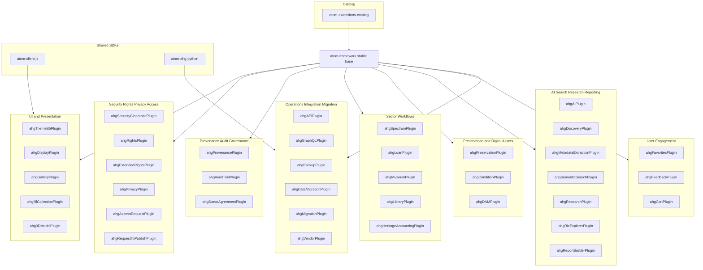
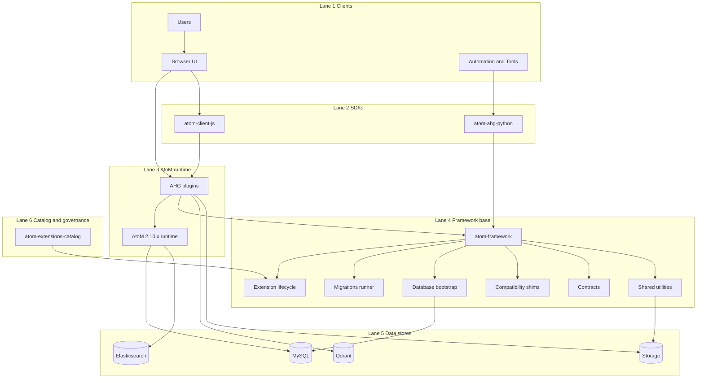

# Archive & Heritage Group (AHG)

Archive & Heritage Group (AHG) builds production-grade extensions, integration tooling, and automation around **Access to Memory (AtoM)** to support archival, records management, and GLAM workflows.

Our engineering model is intentionally modular:

- **atom-framework** is the stable base and changes rarely.
- **Plugins** deliver almost all functional capability.
- **Shared SDKs** prevent duplicated client logic across UI modules and automation tooling.
- **atom-extensions-catalog** is the canonical entry point for documentation and installation patterns.

---

## Start here

1. **atom-extensions-catalog**
   Documentation, catalog and manifest, install and upgrade patterns, compatibility guidance.

2. **atom-framework**
   Stable base platform: extension lifecycle, migrations runner, DB bootstrap, Qubit compatibility shims, contracts and utilities.

3. **atom-ahg-plugins**
   AHG-maintained plugins: rights, privacy, provenance, Spectrum and loans, preservation and condition, IIIF and 3D, research and search, engagement modules.

4. **[Product Roadmap](https://github.com/ArchiveHeritageGroup/atom-extensions-catalog/blob/main/ROADMAP.md)**
   What's completed, in progress, planned, and future — with competitive context.

---

## Architecture overview

### Core principles

- The **framework** provides infrastructure and contracts.
- **Plugins** implement domain features, workflows, and UI.
- **SDKs** provide shared API clients and UI building blocks.
- The **catalog** documents what is supported and how to deploy it.

### Full stack diagram

---

## Repository map

**atom-extensions-catalog** — Canonical documentation and recommended deployment patterns. Catalog and manifest approach for consistent installs and upgrades. Governance entry point for community contributions (plugin registration).

**atom-framework** — Stable base platform intended to change rarely: DB bootstrap and connection ownership, extension lifecycle management (install, enable, disable, dependencies, core and locked), generic migrations runner, Qubit compatibility layer and shims, shared contracts and utilities.

**atom-ahg-plugins** — AHG-maintained plugins providing feature modules: Rights, privacy, and security clearance. Provenance, audit trail, and governance workflows. Spectrum procedures and loan workflows. Preservation, condition, DAM, and display. IIIF and 3D support. AI enrichment, semantic search, research tooling. User engagement modules.

**atom-client-js** — Shared TypeScript library: API client patterns for UI modules, reusable UI widgets and components, consistent handling of authentication, pagination, retries, and error reporting.

**atom-ahg-python** — Shared Python library: API client patterns for automation and integration tooling, consistent auth, pagination, batching, retries. Useful for ETL, migration tooling, processing pipelines, and scheduled jobs.

---

## Compatibility targets

- **AtoM:** 2.10.x
- **PHP:** 8.3
- **Database:** MySQL 8.x
- **Web server:** Nginx with PHP-FPM
- **Search:** Elasticsearch 7.x
- **Vector store:** Qdrant (optional — for semantic search)
- **AI backend:** Ollama / spaCy / Argos Translate (optional — for AI features)

---

## Plugin map by capability

---

## Contribution model

**What to contribute** — New features should be delivered as plugins. The framework is treated as stable base infrastructure and changes are conservative.

**Naming conventions** — Prefix `ahg` is reserved for AHG-maintained plugins. Third parties must use a vendor prefix: `<vendorPrefix><Feature>Plugin`. `machine_name` must match folder name and configuration class prefix. `extension.json` is required and authoritative for version and dependencies.

**Security** — For security issues, use GitHub Security Advisories where enabled. For operational issues, open an issue in the relevant repository with environment details and reproduction steps.

---

**Contact:** [The Archive and Heritage Group](https://theahg.co.za)
**License:** GPL-3.0
