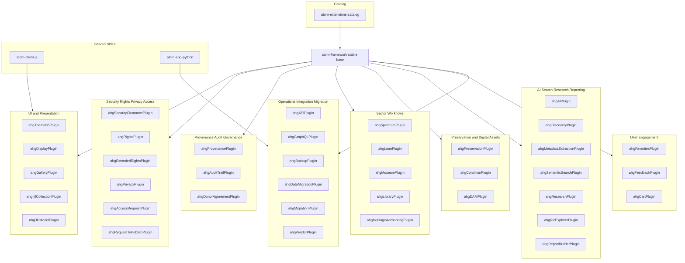
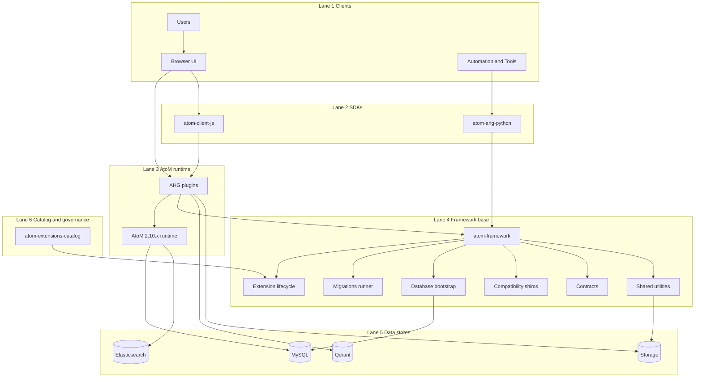

# Archive & Heritage Group (AHG)

Archive & Heritage Group (AHG) builds production-grade extensions, integration tooling, and automation around **Access to Memory (AtoM)** to support archival, records management, and GLAM workflows.

Our engineering model is intentionally modular:

- **atom-framework** is the stable base and changes rarely.
- **Plugins** deliver almost all functional capability.
- **Shared SDKs** prevent duplicated client logic across UI modules and automation tooling.
- **atom-extensions-catalog** is the canonical entry point for documentation and installation patterns.

---

## Start here

1. **atom-extensions-catalog**  
   Documentation, catalog and manifest, install and upgrade patterns, compatibility guidance.

2. **atom-framework**  
   Stable base platform: extension lifecycle, migrations runner, DB bootstrap, Qubit compatibility shims, contracts and utilities.

3. **atom-ahg-plugins**  
   AHG-maintained plugins: rights, privacy, provenance, Spectrum and loans, preservation and condition, IIIF and 3D, research and search, engagement modules.

---

## Architecture overview

### Core principles

- The **framework** provides infrastructure and contracts.
- **Plugins** implement domain features, workflows, and UI.
- **SDKs** provide shared API clients and UI building blocks.
- The **catalog** documents what is supported and how to deploy it.

### Full stack diagram

---

## Product Roadmap

**Framework:** v2.10.24 &nbsp;|&nbsp; **Plugins:** v3.9.30 (88 plugins) &nbsp;|&nbsp; **Updated:** February 2026

> Heratio is a modernization framework for [Access to Memory (AtoM)](https://www.accesstomemory.org/) 2.10 that extends it into a full GLAM management platform. Built on Laravel Query Builder integrated with AtoM's Symfony 1.4 core, it delivers enterprise capabilities through a non-invasive plugin ecosystem while maintaining full backward compatibility.

### Completed

| Capability | Plugin(s) | Notes |
|-----------|-----------|-------|
| **AI Metadata Extraction** | ahgAIPlugin v2.1.0 | NER (spaCy), translation (Argos), summarization, spellcheck, LLM suggestions |
| **AI-Powered Discovery Search** | ahgDiscoveryPlugin | 4-strategy pipeline: ES keyword + NER entity + Qdrant vector + hierarchical. Unified with GLAM browse |
| **AI Condition Assessment** | ahgAiConditionPlugin | YOLOv8 damage detection + EfficientNet classification with archivist review workflow |
| **OAIS Data Ingest** | ahgIngestPlugin | 6-step wizard with SIP/AIP/DIP packaging, 9 AI processing options, background jobs |
| **Landing Page Builder** | ahgLandingPagePlugin | Drag-and-drop block editor with versioning |
| **Enterprise Reporting** | ahgReportBuilderPlugin v2.0 | Rich text editor, Word/PDF/Excel export, 54 data sources, scheduling, collaboration workflow |
| **Heritage Accounting** | ahgHeritageAccountingPlugin v2.0 + ahgIPSASPlugin | Multi-regional: GRAP 103, IPSAS 45, FRS 102, GASB 34, FASB 958, AASB 116, PSAS, IAS 16 |
| **Digital Preservation** | ahgPreservationPlugin | Checksums, fixity, PREMIS events, format registry, PRONOM sync, Siegfried integration |
| **Portable Offline Viewer** | ahgPortableExportPlugin v1.1 | Standalone HTML/JS viewer for CD/USB/ZIP with FlexSearch and hierarchical navigation |
| **Privacy Compliance** | ahgPrivacyPlugin | 7 jurisdictions: POPIA, GDPR, UK GDPR, CCPA, PIPEDA, NDPA, DPA |
| **GraphQL API** | ahgGraphQLPlugin | Full schema with depth/complexity limits, cursor pagination, API key auth |
| **Federation** | ahgFederationPlugin | OAI-PMH harvesting + provider, peer management, provenance tracking |
| **DOI Integration** | ahgDoiPlugin | DataCite minting, queue processing, verification |
| **Records in Contexts** | ahgRicExplorerPlugin | RiC ontology, Fuseki triplestore, SPARQL endpoint |
| **IIIF + 3D** | ahgIiifPlugin + ahg3DModelPlugin | Cantaloupe image server, manifests, Google Model Viewer, AR |
| **Text-to-Speech** | ahgCorePlugin | Browser-native Web Speech API, sector-aware field reading, accessibility |
| **Indigenous Cultural IP** | ahgICIPPlugin | Community registration, TK Labels, consent tracking, cultural notices |
| **Marketplace** | ahgMarketplacePlugin | Fixed-price, auction, multi-currency, seller verification, commission tracking |
| **4 GLAM Sectors** | ahgLibraryPlugin, ahgMuseumPlugin, ahgGalleryPlugin, ahgDAMPlugin | Full sector-specific cataloguing and workflows |
| **Zimbabwe Compliance** | ahgCDPAPlugin, ahgNAZPlugin, ahgNMMZPlugin | CDPA, National Archives Act, National Museums & Monuments Act |

### In Progress

| Capability | Status | Target |
|-----------|--------|--------|
| **Voice Command Interface** | TTS complete; speech recognition (ASR) in development | Q1 2026 |
| **Intelligent Cataloguing** | LLM suggestions working; image similarity + HTR planned | Q2 2026 |
| **Linked Data** | RiC/SPARQL working; Wikidata/VIAF/Getty linking in progress | Q2 2026 |
| **Multi-Tenant Architecture** | Plugin exists (v1.2), currently disabled; domain routing + tenant isolation built | Q2 2026 |

### Planned — H2 2026

| Capability | Description |
|-----------|-------------|
| **Enterprise Authentication** | LDAP/AD, SAML 2.0, OIDC, MFA — dual-mode (SSO + local fallback) |
| **REST API v2** | Full CRUD for all entities, API keys, rate limiting, webhooks, OAI-PMH |
| **Handwritten Text Recognition** | HTR for historical vital records (births, deaths, marriages) |
| **Image Similarity Search** | Visual similarity matching across digital objects |

### Future — 2027+

| Capability | Description |
|-----------|-------------|
| **Multilingual NER** | Custom models for Afrikaans, isiZulu, Sesotho |
| **GIS & Spatial Heritage** | Heritage site mapping, geospatial search, national register integration |
| **SaaS Deployment** | Managed hosting model with Docker containerization |
| **Mobile Field App** | Companion app for field data collection |
| **Extended Standards** | CIDOC-CRM export, public SPARQL, BIBFRAME, PBCore |

### Competitive Context

| Platform | What We're Watching |
|----------|-------------------|
| **ArchivesSpace** | Five-year strategic roadmap (2026-2030), Wikidata plugin, Lyrasis interoperability |
| **CollectiveAccess** | AI automated cataloguing (v2.2), ElasticSearch reimplementation, UI redesign (v3.0) |
| **Arches Project** | Arches Lingo vocabulary management, SPARQL endpoints, GIS capabilities |
| **Archivematica** | Extension architecture, UI simplification, AtoM contributor gatherings |
| **Omeka S** | SaaS model, hierarchy module for archival collections |
| **AtoM Foundation** | AtoM 3 design principles (still in planning — Heratio fills the gap now) |

### Community Gaps Addressed

Of [17 identified community gaps](https://github.com/ArchiveHeritageGroup/atom-extensions-catalog/issues/170) in the AtoM ecosystem, Heratio addresses all 17 — 15 are complete or have working implementations, and 2 are in active development. Notable gaps that AtoM has never roadmapped include: IIIF integration, multi-tenancy, museum/Spectrum support, gallery/CCO, privacy compliance, heritage accounting, condition assessment, and donor management.

---

## Repository map

**atom-extensions-catalog** — Canonical documentation and recommended deployment patterns. Catalog and manifest approach for consistent installs and upgrades. Governance entry point for community contributions (plugin registration).

**atom-framework** — Stable base platform intended to change rarely: DB bootstrap and connection ownership, extension lifecycle management (install, enable, disable, dependencies, core and locked), generic migrations runner, Qubit compatibility layer and shims, shared contracts and utilities.

**atom-ahg-plugins** — AHG-maintained plugins providing feature modules: Rights, privacy, and security clearance. Provenance, audit trail, and governance workflows. Spectrum procedures and loan workflows. Preservation, condition, DAM, and display. IIIF and 3D support. AI enrichment, semantic search, research tooling. User engagement modules.

**atom-client-js** — Shared TypeScript library: API client patterns for UI modules, reusable UI widgets and components, consistent handling of authentication, pagination, retries, and error reporting.

**atom-ahg-python** — Shared Python library: API client patterns for automation and integration tooling, consistent auth, pagination, batching, retries. Useful for ETL, migration tooling, processing pipelines, and scheduled jobs.

---

## Compatibility targets

- **AtoM:** 2.10.x
- **PHP:** 8.3
- **Database:** MySQL 8.x
- **Web server:** Nginx with PHP-FPM
- **Search:** Elasticsearch 7.x
- **Vector store:** Qdrant (optional — for semantic search)
- **AI backend:** Ollama / spaCy / Argos Translate (optional — for AI features)

---

## Plugin map by capability

---

## Contribution model

**What to contribute** — New features should be delivered as plugins. The framework is treated as stable base infrastructure and changes are conservative.

**Naming conventions** — Prefix `ahg` is reserved for AHG-maintained plugins. Third parties must use a vendor prefix: `<vendorPrefix><Feature>Plugin`. `machine_name` must match folder name and configuration class prefix. `extension.json` is required and authoritative for version and dependencies.

**Security** — For security issues, use GitHub Security Advisories where enabled. For operational issues, open an issue in the relevant repository with environment details and reproduction steps.

---

**Contact:** [The Archive and Heritage Group](https://theahg.co.za)  
**License:** GPL-3.0
