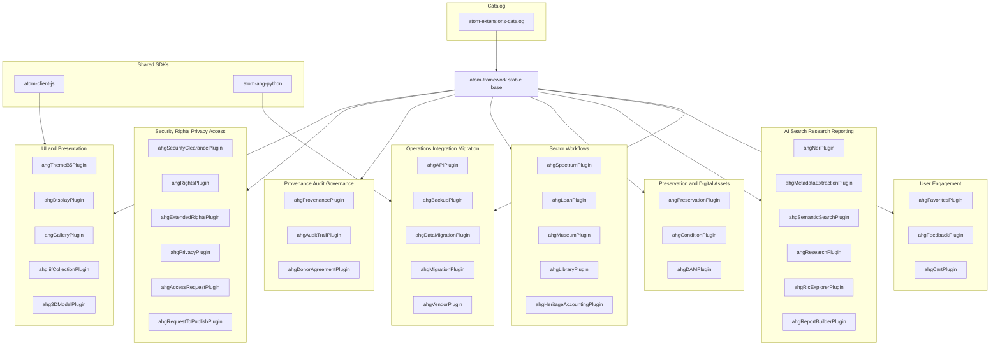

# Archive & Heritage Group (AHG)

Archive & Heritage Group (AHG) builds production-grade extensions, integration tooling, and automation around **Access to Memory (AtoM)** to support archival, records management, and GLAM workflows.

Our engineering model is intentionally modular:

- **atom-framework** is the stable base and changes rarely.
- **Plugins** deliver almost all functional capability.
- **Shared SDKs** prevent duplicated client logic across UI modules and automation tooling.
- **atom-extensions-catalog** is the canonical entry point for documentation and installation patterns.

---

## Start here

1. **atom-extensions-catalog**  
   Documentation, catalog and manifest, install and upgrade patterns, compatibility guidance.

2. **atom-framework**  
   Stable base platform: extension lifecycle, migrations runner, DB bootstrap, Qubit compatibility shims, contracts and utilities.

3. **atom-ahg-plugins**  
   AHG-maintained plugins: rights, privacy, provenance, Spectrum and loans, preservation and condition, IIIF and 3D, research and search, engagement modules.

---

## Architecture overview

### Core principles

- The **framework** provides infrastructure and contracts.
- **Plugins** implement domain features, workflows, and UI.
- **SDKs** provide shared API clients and UI building blocks.
- The **catalog** documents what is supported and how to deploy it.

### Full stack diagram



Repository map
atom-extensions-catalog
Canonical documentation and recommended deployment patterns

Catalog and manifest approach for consistent installs and upgrades

Governance entry point for community contributions (plugin registration)

atom-framework
Stable base platform intended to change rarely:

DB bootstrap and connection ownership

Extension lifecycle management (install, enable, disable, dependencies, core and locked)

Generic migrations runner

Qubit compatibility layer and shims

Shared contracts and utilities

atom-ahg-plugins
AHG-maintained plugins providing feature modules:

Rights, privacy, and security clearance

Provenance, audit trail, and governance workflows

Spectrum procedures and loan workflows

Preservation, condition, DAM, and display

IIIF and 3D support

AI enrichment, semantic search, research tooling

User engagement modules

atom-client-js
Shared TypeScript library:

API client patterns for your UI modules

Reusable UI widgets and components

Consistent handling of authentication, pagination, retries, and error reporting

atom-ahg-python
Shared Python library:

API client patterns for automation and integration tooling

Consistent auth, pagination, batching, retries

Useful for ETL, migration tooling, processing pipelines, and scheduled jobs

Compatibility targets
AtoM: 2.10.x

PHP: 8.3

Database: MySQL 8.x

Web server: Nginx with PHP-FPM

Search: Elasticsearch as required by AtoM deployment

Plugin map by capability
This map describes where each plugin fits, grouped by capability. It is intended to guide deployment planning and contribution boundaries.

```mermaid
%%{init: {"flowchart":{"nodeSpacing":60,"rankSpacing":70}}}%%
flowchart TB

  subgraph L1["Lane 1 Clients"]
    USERS[Users]
    BROWSER[Browser UI]
    AUTO[Automation and Tools]
  end

  subgraph L2["Lane 2 SDKs"]
    JS[atom-client-js]
    PY[atom-ahg-python]
  end

  subgraph L3["Lane 3 AtoM runtime"]
    PLUGINS[AHG plugins]
    ATOM[AtoM 2.10.x runtime]
  end

  subgraph L4["Lane 4 Framework base"]
    FW[atom-framework]
    EXT[Extension lifecycle]
    MIG[Migrations runner]
    DBB[Database bootstrap]
    COMP[Compatibility shims]
    CTR[Contracts]
    UTIL[Shared utilities]
  end

  subgraph L5["Lane 5 Data stores"]
    MYSQL[(MySQL)]
    ES[(Elasticsearch)]
    FS[(Storage)]
  end

  subgraph L6["Lane 6 Catalog and governance"]
    CAT[atom-extensions-catalog]
  end

  USERS --> BROWSER --> PLUGINS --> ATOM
  AUTO --> PY
  BROWSER --> JS

  PLUGINS --> FW
  FW --> EXT
  FW --> MIG
  FW --> DBB
  FW --> COMP
  FW --> CTR
  FW --> UTIL

  ATOM --> MYSQL
  ATOM --> ES
  PLUGINS --> FS
  UTIL --> FS
  DBB --> MYSQL

  CAT --> EXT
  JS --> PLUGINS
  PY --> FW

  ```

Functional summary by plugin
Security, privacy, rights, access
ahgSecurityClearancePlugin
Security classification and clearance controls; restricted access enforcement; compliance-oriented auditing surfaces.

ahgPrivacyPlugin
Privacy policy enforcement and sensitive data handling patterns; supports governance-aligned workflows.

ahgRightsPlugin
Rights statements and usage controls; rights metadata capture and display.

ahgExtendedRightsPlugin
Extended rights models and workflows beyond baseline rights statements; integrates with security and privacy controls.

ahgAccessRequestPlugin
Access request workflow: request, review, approval, and tracking.

ahgRequestToPublishPlugin
Publication request workflow: controlled release with review and approval.

Provenance, auditability, governance
ahgProvenancePlugin
Provenance capture and management separate from donor; provenance-linked reporting and export behaviour.

ahgAuditTrailPlugin
Audit trail capture for accountability and compliance evidence.

ahgDonorAgreementPlugin
Donor agreement records and supporting workflow patterns.

Spectrum, loans, museum sector
ahgSpectrumPlugin
Spectrum-aligned procedures and workflow data capture; sector-specific process tracking.

ahgLoanPlugin
Loan workflow management aligned with Spectrum; request, approval, movement, and tracking patterns.

ahgMuseumPlugin
Museum-sector metadata and operational modules.

ahgHeritageAccountingPlugin
Heritage asset accounting and valuation support; reporting-aligned metadata capture.

Preservation, condition, DAM, media, display
ahgPreservationPlugin
Preservation workflows and preservation metadata capture; operational preservation tooling patterns.

ahgConditionPlugin
Condition assessment workflows; structured capture of condition evidence and related documentation.

ahgDAMPlugin
Digital asset management workflows; asset handling patterns and derivative workflow integration.

ahgDisplayPlugin
UI and display enhancements across AtoM; presentation-oriented widgets and improvements.

ahgGalleryPlugin
Gallery-style browsing and curated presentation features.

ahgIiifCollectionPlugin
IIIF collection and manifest management patterns.

ahg3DModelPlugin
3D model attachment and display integration patterns.

ahgThemeB5Plugin
Bootstrap 5 theme and UI integration for a modernised front-end experience.

AI, extraction, search, research, reporting
ahgNerPlugin
Entity extraction integration to enrich descriptions and support downstream workflows such as redaction and discovery.

ahgMetadataExtractionPlugin
Metadata extraction from files and digital objects; enrichment into AtoM fields.

ahgSemanticSearchPlugin
Embeddings-driven semantic search patterns where deployed and enabled.

ahgResearchPlugin
Researcher-focused UX and workflow enhancements.

ahgRicExplorerPlugin
Context and relationship exploration utilities and navigation patterns.

ahgReportBuilderPlugin
Report design and export patterns; report definitions, dashboards, scheduling, and archive management.

User engagement
ahgFavoritesPlugin
User favourites and bookmarking.

ahgFeedbackPlugin
Feedback capture and moderation workflow.

ahgCartPlugin
Cart and selection workflow for researchers; optional integration point for request and fulfilment patterns.

Integration, migration, operations
ahgAPIPlugin
Integration-oriented API surfaces and helper endpoints as required by the ecosystem.

ahgLibraryPlugin
Library-oriented collection patterns for book and catalogue-like workflows where required.

ahgMigrationPlugin
Migration scaffolding and controlled evolution utilities.

ahgDataMigrationPlugin
Data migration workflows and transformation orchestration.

ahgBackupPlugin
Operational backup and maintenance tooling.

ahgVendorPlugin
Vendor and party management utilities used across modules.

Contribution model
What to contribute
New features should be delivered as plugins.

The framework is treated as stable base infrastructure and changes are conservative.

Naming conventions
Prefix ahg is reserved for AHG-maintained plugins.

Third parties must use a vendor prefix: <vendorPrefix><Feature>Plugin.

machine_name must match folder name and configuration class prefix.

extension.json is required and authoritative for version and dependencies.

Security
For security issues, use GitHub Security Advisories where enabled.

For operational issues, open an issue in the relevant repository with environment details and reproduction steps.
